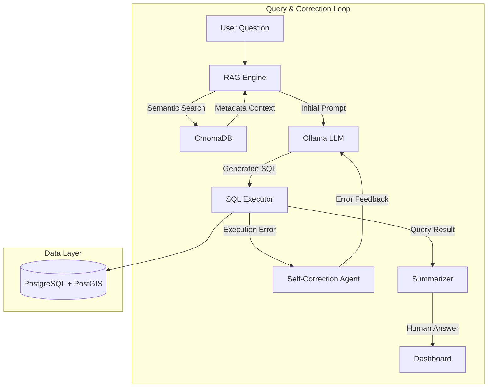

# 🤖 Conversational ARGO Ocean Data Explorer

An AI-powered conversational system for exploring and visualizing ARGO oceanographic data using natural language. This project leverages an **Agentic Retrieval-Augmented Generation (RAG)** framework to democratize access to complex scientific datasets.


## 🌟 Overview

Oceanographic data from the ARGO float program is vast, multi-dimensional, and stored in complex formats like NetCDF. This system allows scientists, researchers, and policymakers to interact with this data using plain English, bypassing the need for specialized SQL or programming knowledge.

The system features an **Agentic SQL Generator** that not only translates natural language to SQL but also **self-corrects** by analyzing database error messages and retrying with refined queries.

## ✨ Key Features

*   **Natural Language to SQL:** Ask questions like *"What is the average temperature at 1000m depth?"* or *"Show me the salinity profile for float 2902121."*
*   **Self-Correcting Agent:** If a generated SQL query fails, the system automatically analyzes the error (e.g., syntax errors, missing columns) and attempts to fix it.
*   **Geospatial Intelligence:** Built-in support for location-based queries using **PostGIS**, enabling spatial analysis of float trajectories and regional ocean states.
*   **Hybrid Retrieval:** Combines semantic search via **ChromaDB** (for metadata and context) with direct relational querying via **PostgreSQL**.
*   **Interactive Dashboard:** A Streamlit-based interface providing real-time summaries, data tables, and interactive Plotly visualizations (maps, profiles, time-series).
*   **Privacy-First & Local:** Runs entirely on local infrastructure using **Ollama**, ensuring data privacy and zero API costs.

## 🛠️ Tech Stack

*   **AI Engine:** [Ollama](https://ollama.ai/) (Llama 3.2 / Llama 3)
*   **AI Framework:** LangChain & Custom Agentic Logic
*   **Databases:**
    *   **Relational:** PostgreSQL + PostGIS (Geospatial & Structured data)
    *   **Vector:** ChromaDB (Contextual metadata embeddings)
*   **Frontend:** Streamlit
*   **Data Processing:** xarray, pandas, NumPy
*   **Visualizations:** Plotly

## 🏗️ System Architecture

The system uses a sophisticated agentic loop to ensure high accuracy and reliability in scientific data retrieval.



## 🚀 Setup and Installation

### 1. Prerequisites
*   Python 3.10+
*   PostgreSQL 14+ with PostGIS extension
*   [Ollama](https://ollama.ai/) installed and running

### 2. Installation
```bash
# Clone the repository
git clone https://github.com/anni-2004/ConversationalAI_on_ArgoFloats.git
cd ConversationalAI_on_ArgoFloats

# Create and activate virtual environment
python -m venv .venv
source .venv/bin/activate  # Windows: .venv\Scripts\activate

# Install dependencies
pip install -r requirements.txt
```

### 3. Database Setup
1.  Create a PostgreSQL database and user.
2.  Enable PostGIS: `CREATE EXTENSION postgis;`
3.  Update `config.py` with your database credentials.

### 4. Run the Application
```bash
# Start the Streamlit dashboard
streamlit run dashboard.py
```

## 🔄 Workflow

1.  **Ingestion:** Raw `.nc` files are processed, flattened, and stored in PostgreSQL. Metadata is embedded and stored in ChromaDB.
2.  **Querying:** User asks a question. The system retrieves relevant float metadata to augment the LLM prompt.
3.  **Generation:** The LLM generates a PostgreSQL query.
4.  **Execution & Correction:** If the query fails, the agentic loop identifies the error type and prompts the LLM to provide a fix.
5.  **Visualization:** Results are summarized and plotted automatically.

## 👥 Contributors
*   **Anirudh**
*   **Shanmukh**
*   Based on original work by Abhishek Tayde

---
*Developed for research and exploration of global oceanographic data.*
